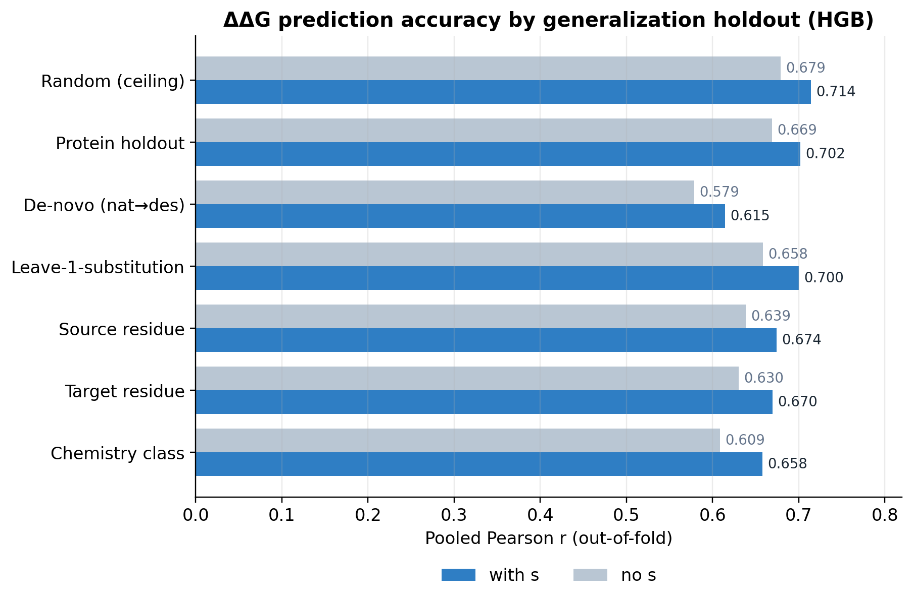
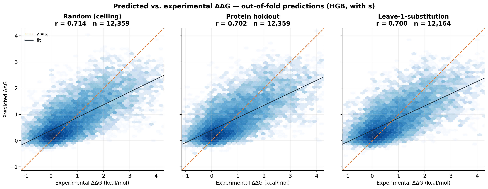
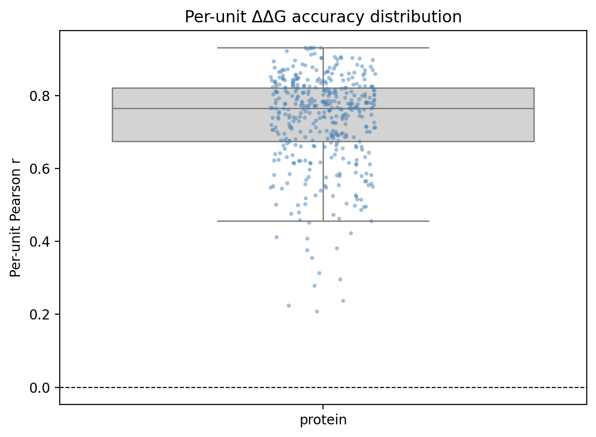
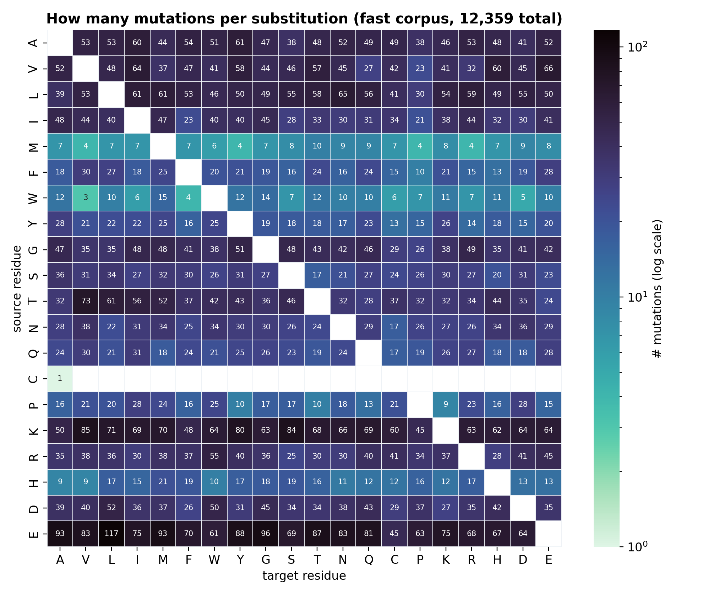
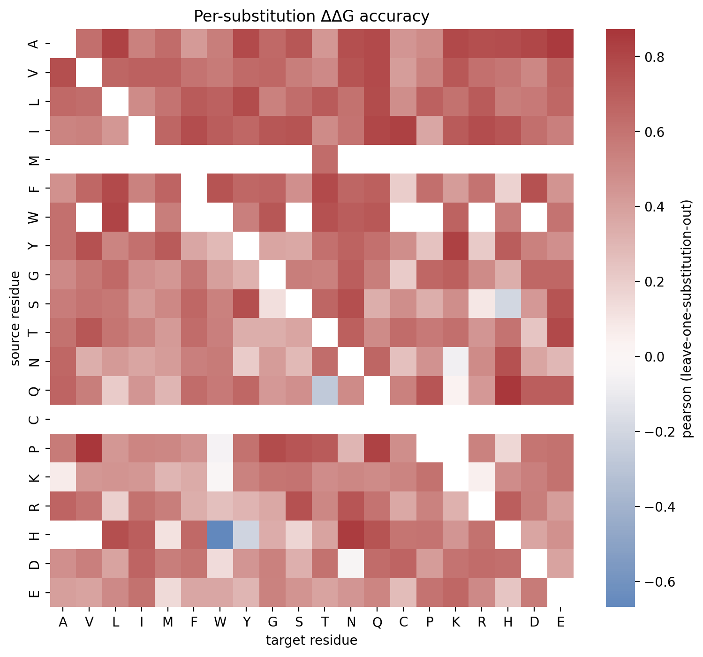
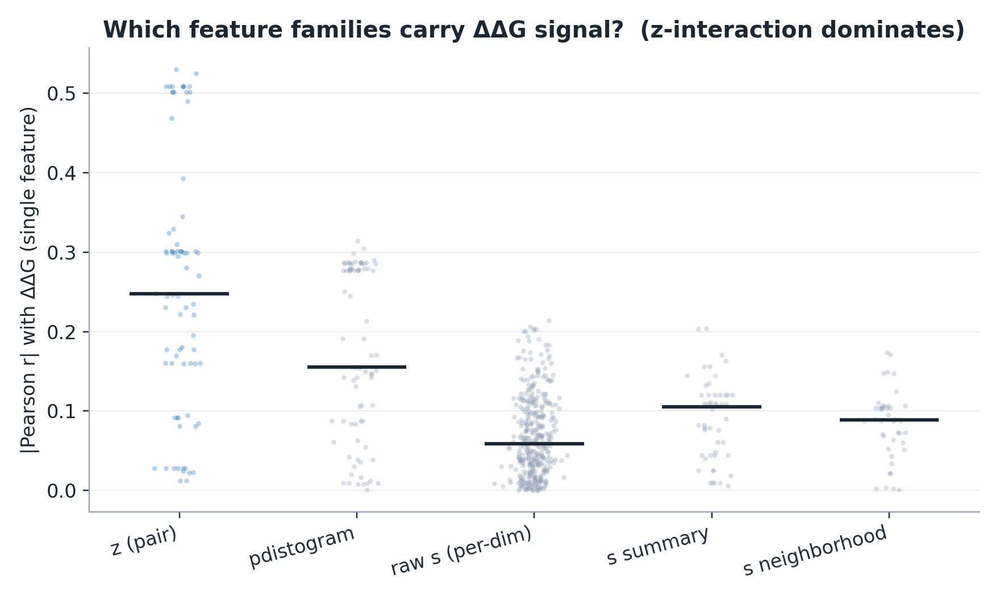
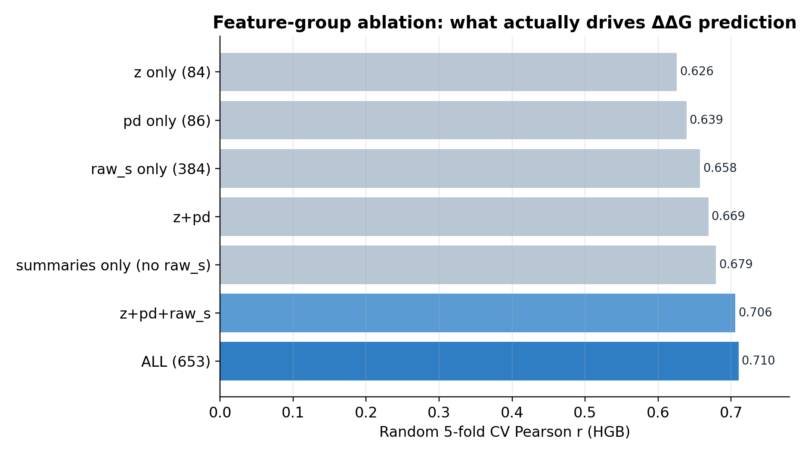
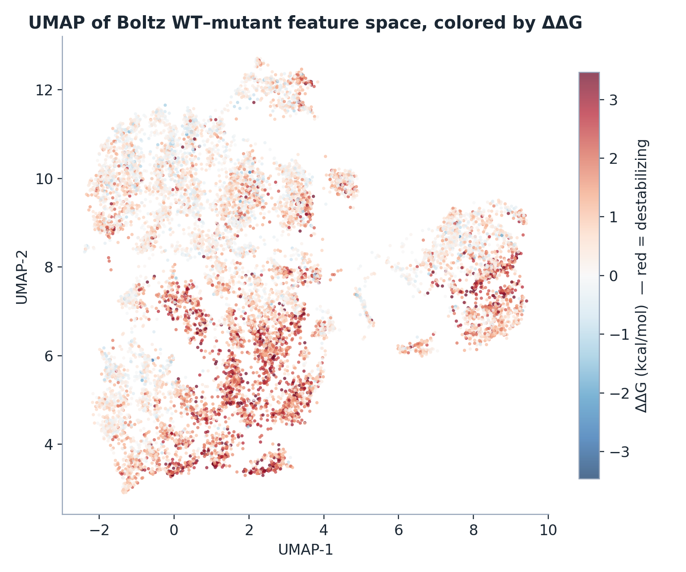

# Predicting ΔΔG from Boltz-2 embeddings — results (fast corpus)

*Status: fast benchmark corpus (12,359 mutations, 412 proteins). The wide corpus
(37k mutations) is running and will refine these numbers; the conclusions below
are already stable across every holdout.*

## Executive summary

Internal representations of **Boltz-2**, run in embeddings-only mode, carry
information that predicts the change in folding free energy (ΔΔG) of single-point
mutations. A gradient-boosted regressor on features derived from the wild-type vs.
mutant embeddings reaches **Pearson r ≈ 0.71** (random CV), and — critically —
**r ≈ 0.70 on held-out proteins**, i.e. it generalizes to proteins never seen in
training rather than memorizing. The single most informative signal is the
**perturbation of the pair representation** (how the mutation reshapes its residue–
residue interaction map); the single-track `s` embedding adds a further ~0.04 r.

---

## 1. Protocol

### 1.1 Data
- **Source:** Tsuboyama et al. 2023 mega-scale stability dataset (single mutants).
  412 protein domains, 32–72 residues, **256 natural** (PDB) + **156 designed / de-novo**.
- **Target:** ΔΔG in kcal/mol (positive = destabilizing). Distribution: mean 0.76,
  SD 1.02; ~46 % of mutations are near-neutral (|ΔΔG| < 0.5).
- **Corpus (this report):** all 412 proteins, ~30 mutations each (stratified),
  **12,359 mutations** — "wide but shallow" so protein/cluster/de-novo holdouts
  see many proteins while chemistry holdouts still cover 360+/380 substitutions.

### 1.2 Feature extraction
1. Run Boltz-2 with `--embeddings_only` on the WT and the mutant sequence
   (same MSA), keeping the trunk outputs: `s` (single track, L×384), `z` (pair,
   L×L×D) and `pdistogram`.
2. From the **WT-vs-mutant difference** at the mutated residue, compute **653
   scalar features** in five families:
   - **raw s (per-dim)** — the 384-dim signed difference of `s` at the mutated site;
   - **s summary / s neighborhood** — mean/SD/gini/entropy/skew of the s difference,
     locally and over a ±5 window;
   - **z (pair)** — summary stats of the mutated residue's interaction *row*
     `z[i,:]` and diagonal `z[i,i]` (abs/signed/L2);
   - **pdistogram** — analogous stats + KL divergence of the distance distribution.
3. Store compactly (`slim`): full `s` (float32), plus the mutation-row of `z`/
   `pdistogram` (all the extractor reads), as float16.

### 1.3 Model
- **HistGradientBoostingRegressor** (median-impute → standardize → HGB).
  Chosen over the project's original SVR because **SVR is O(n²–³)** and became
  infeasible at this scale (a single random-CV eval took ~6 h and could not finish
  the per-substitution sweep; on the wide corpus it would take days). HGB fits the
  12k×653 matrix in ~6 s, so the full holdout suite runs in ~40 min and scales to wide.
- Metrics per holdout: Pearson r, Spearman ρ, RMSE, MAE — pooled (out-of-fold)
  and, where meaningful, the per-unit distribution.

### 1.4 Generalization holdouts
Each is a different train/test split of the **same** feature table (Boltz is not
re-run):

| Holdout | Split | Question |
|---|---|---|
| random | 10-fold CV | interpolation ceiling |
| protein | 5-fold grouped by protein | generalize to unseen proteins |
| de-novo | train natural → test designed (& reverse) | out-of-evolution transfer |
| substitution | leave-one-A→B-out (×~360) | transferable residue chemistry |
| source / target residue | leave-all-X→\* / \*→X out | role of original / introduced residue |
| chemistry | leave-one-class-out (charge, X→P, hydrophobic↔polar, …) | physicochemical rules |

*(Homology / cluster holdout is defined but not yet run — see Limitations.)*

---

## 2. Results

### 2.1 Prediction accuracy and generalization

| Holdout | Pearson r | reads as |
|---|---|---|
| **random (ceiling)** | **0.714** | Boltz features predict ΔΔG |
| **protein** | **0.702** | generalizes to unseen proteins |
| de-novo | 0.615 | transfers to designed proteins (harder) |
| substitution | 0.700 | transferable residue chemistry |
| source residue | 0.674 | |
| target residue | 0.670 | |
| chemistry | 0.658 | physicochemical rules transfer |

Random CV also gives RMSE 0.712 and MAE 0.523 kcal/mol (ΔΔG SD is 1.02), Spearman 0.675.

**The headline is the small random→protein gap (0.714 → 0.702).** If the model were
memorizing proteins, protein-holdout accuracy would collapse; it barely moves. The
model has learned a largely protein-transferable mapping from embedding perturbation
to stability change.

The out-of-fold predictions directly:

The three panels barely differ — random, unseen-protein and unseen-substitution
all cluster the same way around the diagonal, which is the visual form of the
generalization result. **One caveat is visible: the fit line (black) is shallower
than the identity (orange) — the model *regresses toward the mean* and
systematically under-predicts the most destabilizing mutations (ΔΔG > 2).** This is
typical of a squared-error regressor on a skewed target and is a lead for
improvement (e.g. a heavier-tailed loss or reweighting).

### 2.2 The mean hides nothing bad — per-protein distribution

Across the 412 held-out proteins: per-protein r **mean 0.732, median 0.764, SD 0.128**;
**69 % of proteins score r > 0.7, only 1 % below 0.3, and none below 0.** There is no
family where the model silently fails — unusual and reassuring for a stability predictor.

### 2.3 Chemistry is transferable

Holding out entire amino-acid substitutions (A→B) and predicting them from the
*other* substitutions still gives **r ≈ 0.70 pooled** — the model captures chemistry
that transfers across substitution types, not per-substitution lookups.

**First, how much data backs each substitution** (this also explains the gaps in
the accuracy map below):

Counts are very uneven: `E` is a common source (up to 117 E→L), while `M`, `W` and
especially `C` are rare (cysteine appears as a source in a single substitution,
n=1). Substitutions with < 10 examples are dropped from the accuracy analysis,
which is why the accuracy map has blank cells for most `C→`, `M→` and `W→` rows.

**Accuracy per substitution** — each cell is the Pearson r for that A→B, when A→B
was held out of training:

> **Reading the two "0.70"s.** The **0.70 above is the *pooled* r** — one Pearson
> over all ~12k held-out predictions at once, which benefits from getting each
> substitution's *baseline* ΔΔG right. The **per-cell values average to ~0.53**
> (a stricter *within-substitution* ranking, on tens of points each, so individual
> cells — especially the few negative ones like H→W at n=10 — are noisy). Both are
> valid; they answer different questions.

---

## 3. Does the single-track `s` embedding help? (ablation)

We re-ran the whole suite with the s-derived features removed (`--drop-s`):

| Holdout | with s | no s | **s adds** |
|---|---|---|---|
| random | 0.714 | 0.679 | **+0.035** |
| protein | 0.702 | 0.669 | **+0.033** |
| de-novo | 0.615 | 0.579 | **+0.036** |
| substitution | 0.700 | 0.658 | **+0.042** |
| source residue | 0.674 | 0.639 | +0.035 |
| target residue | 0.670 | 0.630 | +0.040 |
| chemistry | 0.658 | 0.609 | +0.049 |

**`s` consistently adds ~0.03–0.05 r across every axis** — a small but real and
robust improvement. (It even *understates* s's value: the first run stored `s` in
float16, which overflowed to inf/NaN for large values; we now store `s` in float32.)
Conclusion: **keep `s`.**

---

## 4. Are the engineered features worth it? What are we actually testing?

**What we test.** The regression asks a single question: *does Boltz's internal
representation of a mutation encode its effect on stability?* The answer is yes
(r ≈ 0.71). Everything else is about *which part* of the representation carries it,
and *whether our hand-crafted features are the right way to read it out.*

### 4.1 Where the signal lives (single-feature correlations)

The strongest **single** features by far are from the **pair representation `z`**:
`interact_z_abs_sum` correlates with ΔΔG at **r = 0.53**. This is physically
interpretable — it measures how much the mutation perturbs its residue's *entire
interaction row*; a mutation that disrupts many contacts destabilizes more. The
`pdistogram` (distance-distribution) features follow (~0.31), then the raw `s`
dimensions (individually weak, ≤0.21, but there are 384 of them).

### 4.2 What the model actually uses (feature-group ablation)

Random 5-fold CV (HGB) on feature subsets:

| Feature set | r | n |
|---|---|---|
| **ALL** | **0.710** | 653 |
| z + pd + raw s  *(drop s-summary stats)* | 0.706 | 554 |
| summaries only *(no raw s)* | 0.679 | 269 |
| pair only (z + pd) | 0.669 | 170 |
| raw s per-dim only | 0.658 | 384 |
| pd only | 0.639 | 86 |
| z only | 0.626 | 84 |

**My reading — and I agree with your instinct, partially:**

- **The hand-crafted `s` summary statistics (gini / entropy / skew / kurtosis of the
  s difference) are not worth it.** Dropping all 99 of them costs **+0.004 r**
  (0.710 → 0.706). That is the "edge" to discard — those features are noise/redundancy
  on top of the raw signal.
- **The raw per-dimension `s` difference *is* worth it** — 0.658 on its own, and it
  is what lifts the pair-only model from 0.669 to 0.710.
- **The `z`/`pdistogram` summaries are justified**, but for a different reason: the
  pair row is a *variable-length* object (L×D), so you *must* pool it into fixed-length
  features. The z-interaction magnitude is the single best predictor we have.

So the feature engineering is real but over-built. A leaner, more defensible feature
set is **raw `s` difference + z/pd interaction-magnitude pooling**, dropping the
statistical-moment features on `s`. A natural next step is to skip pooling entirely
and let a small network read the raw `s` difference and a pooled `z` directly —
likely to match or beat 0.71 with fewer, more interpretable inputs.

### 4.3 The feature space is organized by stability

UMAP of the 653-dim feature space, colored by ΔΔG: destabilizing mutations (red)
occupy coherent regions rather than scattering randomly — visual confirmation that
the features encode stability-relevant structure, not noise.

---

## 5. A note on the model (SVR vs HGB)

The project's original **SVR** actually scored slightly *higher* on the holdouts it
could finish (random 0.758, protein 0.736, de-novo 0.630 vs HGB 0.714 / 0.702 /
0.615) — the RBF kernel captures a bit more here. But SVR does not scale (see §1.3),
so **HGB is the workhorse** and SVR is a small-scale reference point. The gap
(~0.04) is worth noting but does not change any conclusion.

---

## 6. Limitations & next steps

- **Homology (cluster) holdout not yet run** — needs an MMseqs2 30 %-identity cluster
  map; the first identity-clustering attempt over-merged (single-linkage percolation)
  and needs a coverage-gated fix. This is the one missing generalization axis.
- **Wide corpus (37k mutations) running** — will tighten every number and firm up the
  de-novo and per-substitution estimates; conclusions are not expected to change.
- **Prune the s-summary features** (§4.2) — free simplification, ~0 accuracy cost.
- **Consider a learned read-out** on raw `s` + pooled `z` instead of hand-crafted stats.
- Structure-based holdouts (buried/surface, secondary structure) remain future work
  (need DSSP/SASA annotation).
