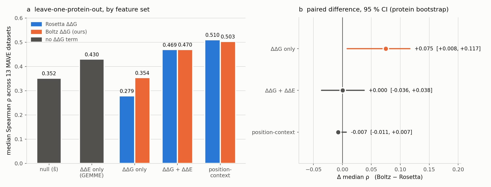

# 15 — MAVE stability→function transfer (RF4Mave)

**Status:** ✅ Done. 25,224 structures, full corpus, no gaps. See [`status.md`](status.md)
for the run log.

## What

Does our Boltz-embedding ΔΔG carry stability information competitive with **Rosetta
ΔΔG** for predicting **experimental MAVE fitness**? We reproduce Høie et al. 2022
(*Cell Reports* 38:110207) and swap our ΔΔG in for Rosetta's, everything else held
fixed.

## Why

Every previous benchmark in this series — Tsuboyama, FireProt, S669, Ssym — shares
ΔΔG as the target, so they all inherit the same assay conventions and curation
lineage. Results 11–13 showed the remaining error is domain shift the features cannot
express, not a fixable calibration term. This is the first test of whether the
representation carries stability information that survives a **change of question**:
the label here is cellular fitness, measured in other labs, by other assays, in units
that are not kcal/mol.

The point is *not* ΔΔG accuracy — that is Tsuboyama's job. A perfect ΔΔG predictor
caps out well below ρ = 1 here, because fitness ≠ stability. Low ρ is only meaningful
**relative to Rosetta's**.

## How

**Corpus.** The 11 Høie proteins ≤200 aa ("Tier 1"), carrying 13 of their 39 MAVE
datasets. Full L×19 saturation of each = **25,224 Boltz structures**. Full saturation
rather than measured-variants-only because their best model needs all 20 substitutions
at a position, and it costs 3.8 % more.

The ≤200 aa cap is a compute budget, and it does not tilt the comparison: median
|ρ(Rosetta ΔΔG, s_exp)| is **0.301** on these 13 datasets and **0.301** on all 39.

**ΔΔG prediction.** Regimes A (Tsuboyama), B (FireProt), D (fine-tuned) — the concat
`wtz|mtz` representation, antisymmetry augmentation, 5-seed MLP ensemble adopted in
results/07 and used by 08/09.

**Two comparison layers**, both on identical variants:
- *Direct* (their Fig 2A): per-dataset Spearman of each predictor against s_exp, no model.
- *RF4Mave* (their Fig 2B): their leave-one-protein-out random forest, run once with
  Rosetta's ΔΔG and once with ours. The **paired difference** is the result.

**Coverage matching.** Our full-saturation scan has a ΔΔG for 100 % of scored variants
and 95 % of position-grid cells; Rosetta has 95.7 % and 90.9 %. By default our ΔΔG is
masked to Rosetta's availability so both arms see identical missingness and identical
row sets — otherwise the Boltz arm would win partly on coverage, and their `-x 2` filter
would score the two arms on different subsets. `--no-match-coverage` reports what the
coverage advantage is worth on its own.

**Leakage.** UBI4 (ubiquitin) is the only Tier-1 protein homologous to Tsuboyama at
25 %/30 % identity — it clusters with `1UBQ.pdb`. 2 of 13 datasets. Everything is
reported full and UBI4-dropped. SUMO1 and UBE2I are clean: the ubiquitin *fold*
similarity falls below 25 % sequence identity.

## Headline numbers

**Our ΔΔG is a better standalone stability predictor of MAVE fitness than Rosetta's —
and that advantage disappears the moment conservation is in the model.**

Leave-one-protein-out, median Spearman ρ across the 13 MAVE datasets. Both arms scored
on identical rows with identical missingness; the only difference is which ΔΔG occupies
the stability slot. CI is a 95 % bootstrap over the 11 proteins, paired within each
resample.

| feature set | Rosetta | **Boltz (ours)** | Δ | 95 % CI |
|---|---|---|---|---|
| null (s̃ substitution matrix) | 0.352 | — | — | — |
| ΔΔE only (GEMME) | 0.430 | — | — | — |
| **ΔΔG only** | 0.279 | **0.354** | **+0.075** | **[+0.008, +0.117]** ✔ |
| ΔΔG + ΔΔE | 0.469 | 0.470 | +0.000 | [−0.036, +0.038] |
| position-context (47 feat) | 0.510 | 0.503 | −0.007 | [−0.011, +0.007] |

Direct per-dataset correlation, no model (median |ρ|): Rosetta **0.301**, ours
**0.373**, GEMME **0.497**.

**What it means.** The ΔΔG-only gain is real but modest — the CI clears zero, with a
lower bound of +0.008. The combined and position-context results are *tight nulls*,
not merely unproven: [−0.036, +0.038] rules out a meaningful combined-model advantage.

The most likely explanation for that pattern is that **Boltz sees the MSA**. Our ΔΔG
carries evolutionary signal that Rosetta's pure-physics calculation structurally cannot,
so it wins where conservation is absent and adds nothing once GEMME supplies it
explicitly. results/04 measured MSA as worth ~0.08–0.10 r to this model — close to the
+0.075 gap. **This is a hypothesis, not a demonstration**; the `no_msa` config from
results/04 would settle it (see Next).

**Not leakage.** UBI4 (ubiquitin) is the one protein homologous to Tsuboyama, and the
result is unchanged when it is dropped (Δ +0.075, CI [+0.007, +0.123]). We are in fact
*worse* than Rosetta on both UBI4 datasets — the only two of thirteen where we lose.

**Where the gain lives.** Concentrated in stability-dominated assays. On NUDT15
VAMP-seq abundance — the purest stability readout in the set — Rosetta reaches |ρ| 0.53
and we reach **0.67**. On CALM1, the ΔΔG-blind control, both stay near zero
(0.08 vs 0.11): no false signal.

**Perspective.** GEMME alone (0.430) still beats both ΔΔG predictors, and the full
model reaches 0.51. Stability is not the dominant term in fitness — this experiment
improves one input to that model, it does not overturn its ordering.

## Figures



See [`figures/README.md`](figures/README.md).

## Next

- **The MSA-confound test.** Rebuild this corpus with `no_msa: true` (results/04's
  config) and re-run. If single-sequence Boltz ΔΔG still beats Rosetta on ΔΔG-only, the
  gain is structural; if it collapses to parity, the gain is evolutionary signal and the
  honest framing is that Boltz-ΔΔG is a partly-conservation predictor.
- **Tier 2** (≤250 aa: +HSP82, TPK1, TPMT, Src; ~145–200 GPU-h) would add a second
  VAMP-seq abundance set and HSP82, the sharpest ΔΔG-blind control in the paper
  (Rosetta 0.039 vs GEMME 0.522), and would tighten a CI whose lower bound is currently
  +0.008.

## Data & provenance

| what | where |
|---|---|
| Paper | `theory/biblio/marce/RF4Mave.pdf` — doi:10.1016/j.celrep.2021.110207 |
| Source data | Zenodo `10.5281/zenodo.5647207`; `github.com/KULL-Centre/papers/tree/main/2021/ML-variants-Hoie-et-al` |
| Fetched to | `data/raw/mave_hoie/` (gitignored, 252 MB) — `fetch_hoie.py` |
| Corpus | `data/raw/mave_hoie_le200.csv` (25,213 mutations / 11 proteins) |
| Labels | `data/raw/mave_hoie_le200_labels.csv` (24,499 rows: s_exp, Rosetta ΔΔG, GEMME ΔΔE, ss, rsa) |
| Config | `experiment_configs/mave_hoie_le200.yaml` |
| Processed | `data/processed/mave_hoie_le200/` (cluster; slim store synced back here) |
| Features | `data/processed/mave_hoie_le200/features_summary.parquet` |
| ΔΔG predictions | `data/processed/mave_hoie_le200/mave_ddg_predictions.csv` |
| Training corpora | `data/processed/{tsuboyama_bench_fast,fireprot_le500}/features_ablation.parquet` (**local only** — the cluster has neither) |
| Leakage map | `homology/mave_le200_leakage.csv` |
| Phase-0 tables | `phase0/lopo_summary.csv`, `phase0/lopo_per_dataset.csv` |
| Result tables | `layer1_direct.csv`, `layer2_lopo_summary.csv`, `layer2_lopo_per_dataset.csv`, `bootstrap_protein{,_noubi4}.csv` |
| Preliminary (2.4 % short) | `preliminary/` — kept only to show the gap did not move the numbers |

## Reproduce

```bash
python results/15_mave_stability_transfer/fetch_hoie.py
python results/15_mave_stability_transfer/build_corpus.py
MMSEQS_BIN=/path/to/mmseqs python results/15_mave_stability_transfer/build_homology_map.py
python results/15_mave_stability_transfer/rf4mave.py          # Phase 0 gate (~1 h)

# on cranex, after landing the config + corpus CSV:
./slurm/submit_scan.sh experiment_configs/mave_hoie_le200.yaml 256 3
# then rsync data/processed/mave_hoie_le200/{slim,features_summary.parquet,...} back

python results/15_mave_stability_transfer/check_frames.py     # verify the feature rebuild
python results/15_mave_stability_transfer/predict_ddg.py      # regimes A/B/D
python results/15_mave_stability_transfer/score.py            # both comparison layers
python results/15_mave_stability_transfer/bootstrap.py        # CI on the paired gap
python results/15_mave_stability_transfer/bootstrap.py --drop-ubi4
python results/15_mave_stability_transfer/make_figures.py
```

## Notes for whoever picks this up

- The embeddings are kept (`slim.keep_s: true`, ~5.8 GB) precisely so **other models
  and feature blocks can be tried without re-running Boltz**. The slim store keeps the
  mutated residue's full `z` row, the matching `pdistogram` row, and full `s` — lossless
  for anything derived from those. It does *not* keep the rest of the L×L pair tensor,
  so a feature needing couplings between arbitrary residue pairs would need a re-run.
- `head.mode: inference` is deliberate. MAVE fitness is not ΔΔG and must never occupy
  the `ddg` column; it is joined back on `(uniprot, mutation)` after the fact.
- `rf4mave.py` follows their released **code**, not the paper prose — the two differ on
  details that matter (the −100 missing sentinel, the `-x 2` filter, the exact RF
  hyperparameters). See the module docstring.
